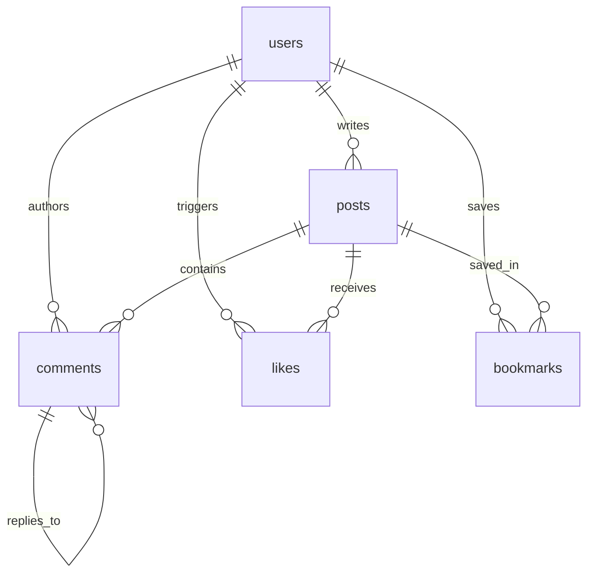
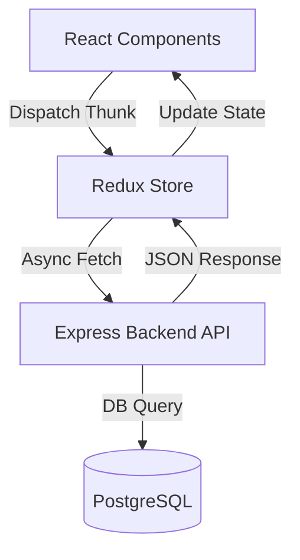

# Project Architecture Documentation - AetherBlog

This document describes the design, data schemas, state management, and page routing of the full-stack Blog Platform application.

---

## 1. Database Architecture (PostgreSQL)

The database schema, defined in `backend/src/config/schema.sql`, utilizes relational structures, check constraints, indexes, and cascade deletions to ensure integrity.

### Table Definitions

1. **`users`**:
   - `id` (SERIAL PRIMARY KEY)
   - `username` (VARCHAR UNIQUE, NOT NULL)
   - `email` (VARCHAR UNIQUE, NOT NULL)
   - `password_hash` (TEXT, NOT NULL)
   - `bio` (TEXT)
   - `avatar_url` (TEXT)
   - `created_at` / `updated_at` (TIMESTAMP WITH TIME ZONE)

2. **`posts`**:
   - `id` (SERIAL PRIMARY KEY)
   - `author_id` (INT NOT NULL, FOREIGN KEY -> `users.id` ON DELETE CASCADE)
   - `title` (VARCHAR, NOT NULL)
   - `slug` (VARCHAR UNIQUE, NOT NULL)
   - `content` (TEXT, NOT NULL)
   - `excerpt` (TEXT)
   - `cover_image` (TEXT)
   - `tags` (TEXT[] DEFAULT '{}')
   - `is_published` (BOOLEAN DEFAULT FALSE)
   - `created_at` / `updated_at` (TIMESTAMP WITH TIME ZONE)

3. **`comments`**:
   - `id` (SERIAL PRIMARY KEY)
   - `post_id` (INT, FOREIGN KEY -> `posts.id` ON DELETE CASCADE)
   - `author_id` (INT, FOREIGN KEY -> `users.id` ON DELETE CASCADE)
   - `parent_id` (INT, FOREIGN KEY -> `comments.id` ON DELETE CASCADE for self-referential tree nesting)
   - `content` (TEXT, NOT NULL)
   - `created_at` / `updated_at` (TIMESTAMP WITH TIME ZONE)

4. **`likes`** & **`bookmarks`**:
   - `id` (SERIAL PRIMARY KEY)
   - `user_id` (INT, FOREIGN KEY -> `users.id` ON DELETE CASCADE)
   - `post_id` (INT, FOREIGN KEY -> `posts.id` ON DELETE CASCADE)
   - `created_at` (TIMESTAMP)
   - Unique constraints on `(user_id, post_id)` to prevent duplicates.

---

## 2. Backend API Architecture (Express)

The backend is built in Express using ES Modules (`"type": "module"`). It connects to PostgreSQL using a pg connection pool.

### API Endpoints List

| Category | Method | Path | Auth | Description |
| :--- | :--- | :--- | :---: | :--- |
| **Auth** | POST | `/api/auth/register` | Public | Registers a user and returns a signed JWT. |
| | POST | `/api/auth/login` | Public | Logs in a user, returns JWT and user profile. |
| | GET | `/api/auth/me` | Protected | Returns details of the logged-in user. |
| | PUT | `/api/auth/profile` | Protected | Updates the logged-in user's bio and avatar. |
| **Posts**| GET | `/api/posts` | Public | Paginated search list of published posts. |
| | GET | `/api/posts/my` | Protected | Lists current user's posts & drafts. |
| | GET | `/api/posts/bookmarks` | Protected | Lists current user's bookmarked posts. |
| | GET | `/api/posts/user/:userId`| Public | Paginated list of a specific user's posts. |
| | GET | `/api/posts/:slug` | Optional | Fetches a post by slug. Annotates with custom `is_liked` and `is_bookmarked` flags if authenticated. |
| | POST | `/api/posts` | Protected | Creates a new post (published or draft). |
| | PUT | `/api/posts/:id` | Protected | Updates an existing post (owner restricted). |
| | DELETE| `/api/posts/:id` | Protected | Deletes a post (owner restricted). |
| | POST | `/api/posts/:id/like` | Protected | Likes a post. |
| | DELETE| `/api/posts/:id/like` | Protected | Unlikes a post. |
| | POST | `/api/posts/:id/bookmark`| Protected | Bookmarks a post. |
| | DELETE| `/api/posts/:id/bookmark`| Protected | Removes bookmark. |
| **Comments**| POST| `/api/comments` | Protected | Adds a comment (supports `parent_id` replies). |
| | GET | `/api/comments/post/:postId`| Public | Flat chronologically sorted comments list. |
| | PUT | `/api/comments/:id` | Protected | Edits a comment's content (owner restricted). |
| | DELETE| `/api/comments/:id` | Protected | Deletes a comment + children (owner restricted). |

---

## 3. Frontend Architecture (React + Redux)

The frontend is a React application utilizing **Redux Toolkit** for structured state updates, side-effect thunks, and unified caching.

### Redux State Slices

1. **`auth`** (`frontend/src/store/authSlice.js`):
   - **State**:
     - `token`: JWT string (persisted to localStorage).
     - `user`: Authenticated user metadata object.
     - `isAuthenticated`: Boolean flag.
     - `status`: `'idle' | 'loading' | 'succeeded' | 'failed'`.
     - `error`: Error message text.
   - **Thunks**: `registerUser`, `loginUser`, `fetchCurrentUser`, `updateUserProfile`.

2. **`posts`** (`frontend/src/store/postsSlice.js`):
   - **State**:
     - `posts`: List of public feed posts.
     - `myPosts`: List of user's personal posts and drafts.
     - `bookmarks`: List of user saved posts.
     - `currentPost`: Active detail viewing post.
     - `pagination`: `{ total, page, limit, totalPages }`.
   - **Thunks**: `fetchAllPosts`, `fetchPostBySlug`, `createNewPost`, `updateExistingPost`, `deleteExistingPost`, `fetchMyPosts`, `fetchBookmarks`, `toggleLikePost`, `toggleBookmarkPost`.

3. **`comments`** (`frontend/src/store/commentsSlice.js`):
   - **State**:
     - `comments`: Flat array of comment nodes.
   - **Thunks**: `fetchPostComments`, `addComment`, `updateCommentContent`, `removeComment`.

---

## 4. Frontend Routing (React Router)

Routing configuration is set up in `frontend/src/App.jsx` with route-level middleware protection:

- **`/`**: Home Route. Loads `Home.jsx`.
  - **If Logged Out**: Renders a landing page displaying a visual hero, features, and public grid.
  - **If Logged In**: Renders a dashboard displaying user stats, filtering tabs (Feed, My Posts, Bookmarks), draft indicators, and action triggers.
- **`/login` / `/signup`**: Auth pages rendering login/registration cards. Redirects home if already logged in.
- **`/posts/:slug`**: Article Detail view displaying full cover images, author profiles, and interactive like/bookmark triggers alongside nested replies.
- **`/create-post` / `/edit-post/:id`** *(Protected)*: Writing editor canvas providing options to save drafts or publish.
- **`/profile`** *(Protected)*: User profile manager to modify biography texts and avatar URLs.
- **`/bookmarks`** *(Protected)*: Feed displaying articles saved by the user.
